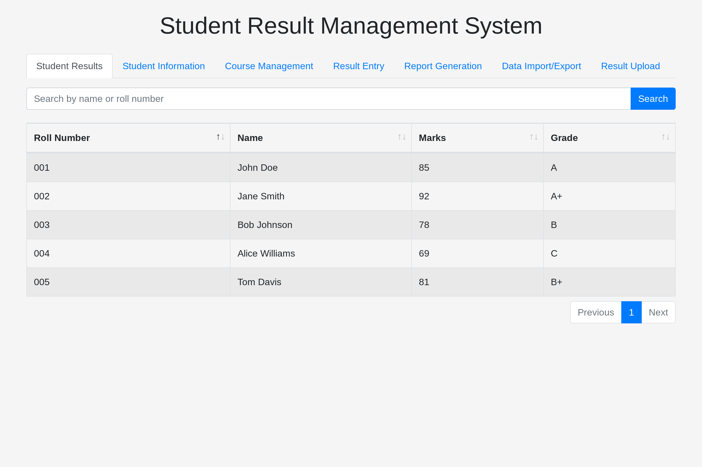

# Student Result Management System

This Student Result Management System is a web application designed to streamline the process of managing student information, recording results, and generating reports. Below is an extensive guide on how to use and understand the system.

## Table of Contents
1. [Introduction](#introduction)
2. [Features](#features)
3. [Usage](#usage)
    - [Student Results](#student-results)
    - [Student Information](#student-information)
    - [Course Management](#course-management)
4. [Dependencies](#dependencies)
5. [Backend](#backend)
6. [Credits](#credits)

## Introduction

The Student Result Management System is built to simplify the management of student data within an educational institution. It provides a user-friendly interface for administrators to input, update, and retrieve student information and academic results.

## Features

- **Student Results**: View a list of students along with their roll numbers, names, marks, and grades.
- **Student Information**: Add new students and view existing student information, including roll numbers, names, and emails.
- **Course Management**: Add new courses and view existing course information, including course codes, names, and instructors.
- **Data Import/Export**: Import and export student and course data for easy backup and transfer.
- **Result Entry**: Enter and update student results seamlessly.
- **Report Generation**: Generate reports based on various criteria such as student performance, course enrollment, etc.

## Usage

### Student Results

- **Search**: Utilize the search functionality to find specific students by name or roll number.
- **Result Display**: View student results including roll numbers, names, marks, and grades in a tabular format.

### Student Information

- **Add New Student**: Fill out the form with the student's roll number, name, and email to add a new student to the system.
- **Student List**: View a list of existing students along with their roll numbers, names, emails, and perform actions like editing or deleting student information.

### Course Management

- **Add New Course**: Enter the course code, name, and instructor's name in the form to add a new course to the system.
- **Course List**: View a list of existing courses along with their codes, names, instructors, and perform actions like editing or deleting course information.

## Dependencies

This system relies on the following dependencies:
- Bootstrap 4.5.2
- jQuery 3.5.1
- DataTables 1.10.22

These dependencies are loaded via CDN links for ease of integration.

## Backend

The backend of this system is developed using 
- Python 3
- Flask
- Firebase.

## Credits

- This system utilizes Bootstrap for styling and layout.
- DataTables plugin is used for displaying data in a tabular format with enhanced features.

Feel free to explore and utilize this Student Result Management System to streamline your academic institution's administrative tasks efficiently. If you encounter any issues or have suggestions for improvement, please don't hesitate to contact the developers.

**Note**: This README provides an overview of the system's functionality. For detailed implementation and technical documentation, refer to the source code and documentation provided with the system.
